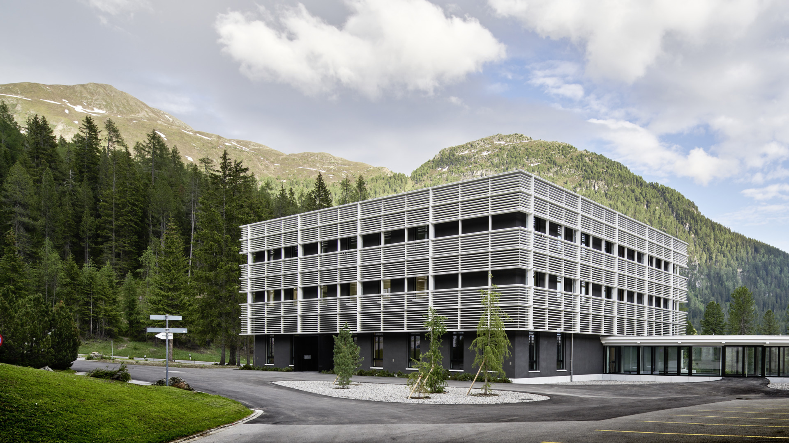

---
# An instance of the Contact widget.
# Documentation: https://wowchemy.com/docs/page-builder/
widget: contact

# This file represents a page section.
headless: true

# Order that this section appears on the page.
weight: 10

title: Contact Wolfgang Davos

subtitle:  

content:
  # Contact (edit or remove options as required)

  email: 'bruggenlab@gmail.com'
  phone: +41 81 410 08 44
  address:
    street: Herman-Burchard-Strasse 9
    city:  Davos Wolfgang
    region: CH
    postcode: '7265'
    country: Switzerland
    country_code: CH
#  coordinates:
#    latitude: '46.829420'
#    longitude: '9.857030'
  directions: Enter Building 9 and take the stairs to the Floor 1
  office_hours:
    - 'Monday 10:00 to 13:00'
    - 'Wednesday 09:00 to 10:00'

  # Automatically link email and phone or display as text?
  autolink: true

design:
  columns: '2'

---
