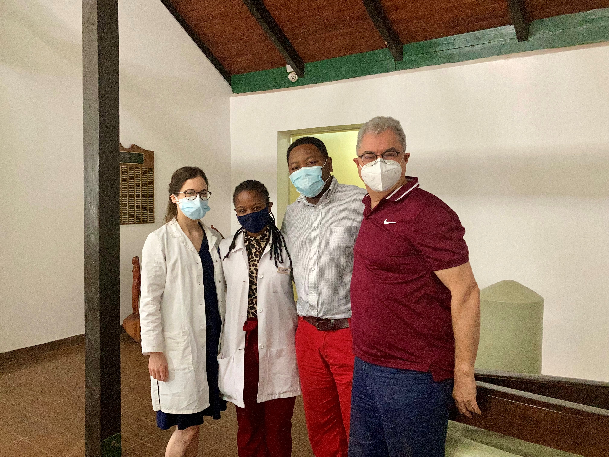

### **Atopic Dermatitis: Sub-Saharan Africa vs. Central Europe**

Atopic dermatitis is a very itchy inflammatory skin disease that affects approximately 5-10% of the Swiss population. The quality of life can be severely affected. Just recently, we start to understand that atopic dermatitis is not only very common in Europe, but also in Africa, where subsequent and possibly life-threatening skin infections can occur.

Not much is known about possible variations in pathogenesis. Are there genetical differences? To what extent does the microbiome of the skin and gut vary? How much are environmental aspects and nutrition playing a role in the manifestation of the disease? To acquire more knowledge about this topic, we can count on long-standing and growing collaborations with partner hospitals in Tanzania and Madagascar.

[Link to the study in Switzerland](https://www.usz.ch/studie/neurodermitis-neurodermitis-in-europa-und-subsahara-afrika/)

[Link to Flyer](https://www.usz.ch/app/uploads/2022/02/2021_12_23_Flyer_Tanzania_V1.4.pdf)

[RDTC – our collaborational partner in Tanzania](https://www.rdtc.ac.tz/)

### **Atopic Dermatitis and Cardiovascular Diseases**

Do atopic dermatitis patients have a higher risk of suffering from cardiovascular diseases? Does the severity of atopic dermatitis play a role in a possible connection? This question is inconsistently answered in the existing literature. Being part of the ProRaD study (Prospective Longitudinal Observational Research in Atopic Dermatitis) with study centers in Davos, Augsburg, Bonn and Zurich, we are investigating these questions further. We are also interested in differences on the protein level, which we look into by performing high-throughput proteomics analyses.

ProRaD study: [Pro-RaD-STUDIE | CK-CARE](https://ck-care.ch/studien/pro-rad-studie/)

### **Atopic Dermatitis and Food Allergies / Intolerances**

Many patients with atopic dermatitis suffer from concurrent food allergies and even a higher percentage reports food-related exacerbations of their disease. In this project, we want to further explore the potential connection between food sensitization/allergies, food intolerances, nutritional habits and atopic comorbidities in atopic dermatitis patients.

ProRaD study: [Pro-RaD-STUDIE | CK-CARE](https://ck-care.ch/studien/pro-rad-studie/)

### **Skin Barrier measurements in atopic dermatitis patients**

The skin barrier of patients with atopic dermatitis is not as strong as in skin-healthy individuals. But how can we measure this? In this project, we perform electrical impedance spectroscopy measurements of the skin with a device called Nevisense®. It is already used in clinical practice for the non-invasive risk assessment of melanoma and is now being used in studies for assessing the skin barrier. Do we find differences between affected and non-affected skin of atopic dermatitis patients? And can we develop an algorithm that is able to distinguish between the skin of patients and skin-healthy populations? We are intrigued to find out more about this topic.

Nevisense: [Nevisense - Increased diagnostic accuracy in the detection of skin cancer and skin barrier alterations (scibase.com)](https://scibase.com/)

  </a>

